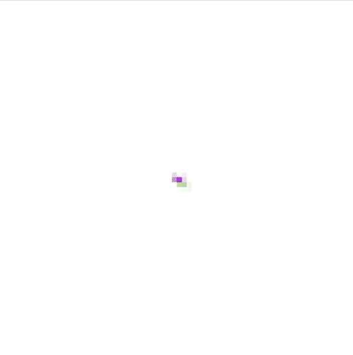

# Growing-Neural-Cellular-Automata

A reproduction of Growing Neural Cellular Automata:

```
Mordvintsev, et al., "Growing Neural Cellular Automata", Distill, 2020.
```

Run "training.ipynb" to train a model, and the "main_pygame_dl.py" to play the demo (A pre-trained model is already given, see ./models).


